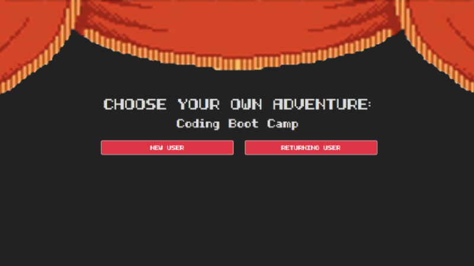
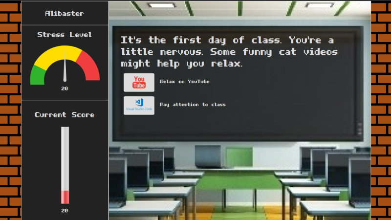
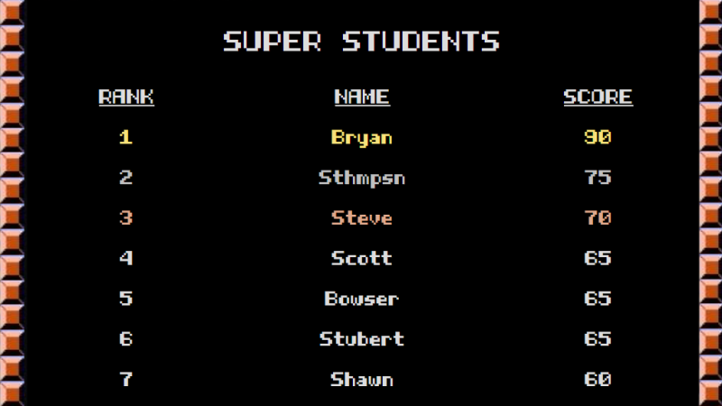

# Boot Camp Adventure

A continuation of group project #2 from my full stack web development boot camp, a choose your own adventure game I really enjoy and wanted to continue working on it on my own.

# Choose Your Own Adventure

Deployed App: [cyoa-bc.herokuapp.com](https://cyoa-bc.herokuapp.com) (this is going to change once I set up heroku).

## Project Description

This application is a Choose Your Own Adventure style game with a coding boot camp/academic theme.  The user creates an account complete with password and input validation.  The game consists of a series of questions, where the user's answer to the question would determine how their score and stress levels change, indicated by gauges.  When the game is over the score is logged to the MySQL database and a scoreboard showing the top 10 players is revealed.

## Technologies Used

* HTML, CSS, Bootstrap, Javascript, jQuery, Node.js, Express.js, Express-validate, Sequelize.js, bcryptjs, MySQL, Heroku, JawsDB, and Gauge.js

## Roles

* Scott (Project Manager, Concept, Back End) [(Portfolio)](http://scottandersondev.com/) [(Github)](https://github.com/scotttanderson)

* Bryan (Front End Design and Development) [(Portfolio)](https://bryanbloomquist.com) [(Github)](https://github.com/bryanbloomquist)

* Steve (Back End, Database) [(Portfolio)](https://sthmpsn.github.io/) [(Github)](https://github.com/sthmpsn)

* Ashlen (Front End Development, Back End) [(Portfolio)](https://ashlenbruns.github.io/) [(Github)](https://github.com/ashlenbruns)

* John (Back End, Database) [(Portolio)](https://evanjo03.github.io/) [(Github)](https://github.com/evanjo03)

## Login Page

## Game Page

## Scoreboard

## Contributing 

Contributions are what make the open source community such an amazing place to be learn, inspire, and create. Any contributions you make are **greatly appreciated**.

1. Fork the Project
2. Create your Feature Branch (`git checkout -b feature/AmazingFeature`)
3. Commit your Changes (`git commit -m 'Add some AmazingFeature'`)
4. Push to the Branch (`git push origin feature/AmazingFeature`)
5. Open a Pull Request